# Personus.ai — Authorization & Permissions

**Version:** 1.0
**Date:** 2026-02-11
**Depends on:** Doc 1 (Foundation & Principles), Doc 2 (Data Model), Doc 8 (Guilds)
**Depended on by:** Doc 3 (API Surface), Doc 5 (Implementation), Doc 7 (AT Protocol)
**Status:** Design phase — Proposal

---

## Table of Contents

1. [Why This Document Exists](#why)
2. [Authorization Model Overview](#overview)
3. [Actors](#actors)
4. [Persona Visibility](#persona-visibility)
5. [Trait-Level Disclosure](#trait-level-disclosure)
6. [Cross-Persona Linking](#cross-persona-linking)
7. [Community Authorization](#community-authorization)
8. [Guild Authorization](#guild-authorization)
9. [Contact Authorization](#contact-authorization)
10. [Endorsement Authorization](#endorsement-authorization)
11. [AI Agent & MCP Authorization](#agent-authorization)
12. [Data Ownership & Delegation](#data-ownership)
13. [Authorization Decision Reference](#decision-reference)
14. [Implementation Guidance](#implementation-guidance)

---

## Why This Document Exists {#why}

Personus has a multi-dimensional authorization model. A single piece of data — say, Maria's "UX design" skill — might be:

- Visible on her professional persona (public)
- Hidden from her gym persona (not included in that persona's traits)
- Discoverable by an AI agent via MCP (authenticated tier)
- Surfaced through a cross-persona link in her gym community (opt-in)
- Endorsable by a colleague (if the trait is marked endorsable)
- Searchable via vector embedding (if the persona is public or authenticated)

This isn't a simple "who can read this row" question. The authorization model must account for:

- **Who is asking** (anonymous, authenticated user, persona, AI agent)
- **What they're asking for** (view, search, contact, endorse, manage)
- **Through what context** (global, community, guild, network)
- **What the data owner configured** (visibility, contact preferences, trait selection, linked personas)

Row-level security is a useful implementation tool for some of these, but the authorization _model_ operates at a higher level. This document defines that model so that every API endpoint, agent tool, and UI surface can answer: **"Should this actor see/do this thing in this context?"**

---

## Authorization Model Overview {#overview}

### Authorization Surfaces Overview

The following diagram shows how actors interact with the authorization system to access protected resources. Each arrow passes through one or more authorization checks.

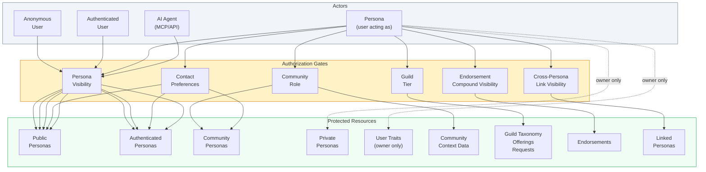

### The Four Questions

Every authorization decision in Personus answers four questions:

```
1. WHO is the actor?          → Actor type + identity
2. WHAT are they trying to do? → Action (view, search, contact, manage, ...)
3. ON WHAT target?             → Entity + specific data within it
4. IN WHAT context?            → Global, community, guild, network, direct
```

### Layered Evaluation

Authorization is evaluated as a series of layers, each of which can narrow access but never widen it. If any layer denies access, the request is denied.

```
Layer 1: Authentication
  → Is the actor identified? (anonymous vs. authenticated vs. system)

Layer 2: Persona Visibility
  → Does the target persona's visibility setting permit this actor?

Layer 3: Context Scope
  → Is the actor in the right context? (community member, network connection, etc.)

Layer 4: Owner Preferences
  → Do the data owner's preferences allow this action? (contact prefs, trait selection)

Layer 5: Role/Tier Permissions
  → Does the actor have the required role/tier for this action? (admin, steward, tier)

Layer 6: Rate & Abuse Limits
  → Has the actor exceeded usage limits? (search rate, contact request caps)
```

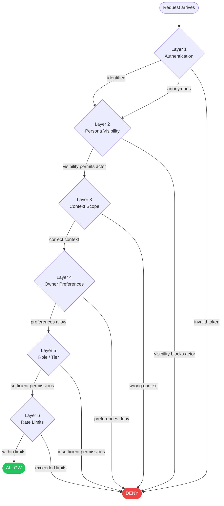

### Principle: Default Deny, Owner Grants

Nothing is visible or accessible by default. Access exists because:

1. The persona owner set visibility to a level that includes the actor
2. The persona owner included specific traits on a specific persona
3. The persona owner opted into a cross-persona link
4. The persona owner joined a community and filled in context data
5. A community admin granted a role
6. A guild tier grants specific permissions

The owner can always revoke. The system never infers or expands access beyond what was explicitly granted.

---

## Actors {#actors}

### Actor Types

| Actor Type             | Identity                    | How Resolved                              | Typical Actions                                             |
| ---------------------- | --------------------------- | ----------------------------------------- | ----------------------------------------------------------- |
| **Anonymous**          | None                        | No auth token                             | View public personas, view public guild pages               |
| **Authenticated User** | Clerk user ID               | Valid session/JWT                         | Browse, search, create personas, join communities           |
| **Persona**            | User + specific persona URI | User selects active persona               | Endorse, contact, join community, manage own data           |
| **Community Member**   | Persona + community membership | Membership row exists                  | View community directory, search within community, see context data |
| **Community Admin**    | Community member + admin role | `role = "admin"` on membership          | Manage community schema, approve members, view analytics    |
| **Guild Steward**      | Community admin + steward tier | Admin role + tier with `canSteward: true` | Route requests, manage taxonomy, vet applicants          |
| **AI Agent (MCP)**     | Agent ID + access tier      | API key / OAuth token                     | Search, request introductions, get persona data             |
| **System**             | Internal                    | Service-to-service auth                   | Compute embeddings, send digests, evaluate tier promotions  |

### Actor Resolution Chain

For any incoming request:

```
1. Authenticate → Clerk session → user ID (or anonymous)
2. Resolve persona → which persona is the user acting as? (from header, session, or route context)
3. Resolve community context → is this request scoped to a community? → look up membership
4. Resolve role/tier → what permissions does this membership grant?
```

For MCP/API requests:

```
1. Authenticate → API key or OAuth token → agent ID + access tier
2. Access tier determines base permissions (see §AI Agent Authorization)
3. No persona context — agents act on behalf of their users, not as personas
```

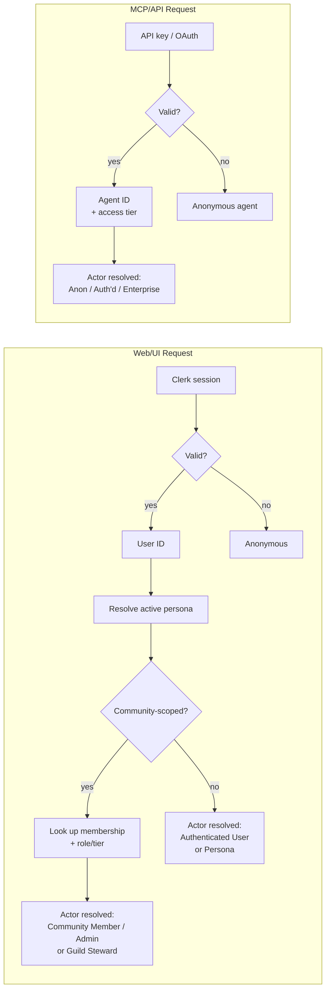

---

## Persona Visibility {#persona-visibility}

### Visibility Levels

Every persona has a `visibility` setting that controls who can discover and view it.

| Level           | Who Can See                              | Search Indexed            | AI Discoverable                | Use Case                               |
| --------------- | ---------------------------------------- | ------------------------- | ------------------------------ | -------------------------------------- |
| `public`        | Anyone, including anonymous              | Yes                       | Yes (all MCP tiers)            | Professional persona, business persona |
| `authenticated` | Logged-in Personus users                 | Yes (auth'd queries only) | Yes (auth'd+ MCP tiers)        | Personal persona, neighborhood persona |
| `community`     | Members of communities the persona belongs to | Community-scoped only  | No (unless community-scoped query) | Gym persona, workplace persona     |
| `private`       | Owner only                               | No                        | No                             | Draft persona, internal notes          |

### What Visibility Controls

Visibility determines whether a persona appears in:

- Search results (vector similarity queries)
- Community directories
- MCP tool responses
- Public web / SEO
- Endorsement target resolution ("Who can I endorse?")

Visibility does **not** control:

- Contact preferences (separate system, see §Contact Authorization)
- Which traits are on the persona (that's trait selection, see §Trait-Level Disclosure)
- Whether someone can send a contact request (that's contact authorization)

### Visibility Evaluation Rules

**Can actor A see persona P?**

```
if P.visibility == "public":
  return ALLOW

if P.visibility == "authenticated":
  return ALLOW if A is authenticated, DENY if anonymous

if P.visibility == "community":
  return ALLOW if A is a member of any community that P belongs to, DENY otherwise

if P.visibility == "private":
  return ALLOW if A.userId == P.userId, DENY otherwise
```

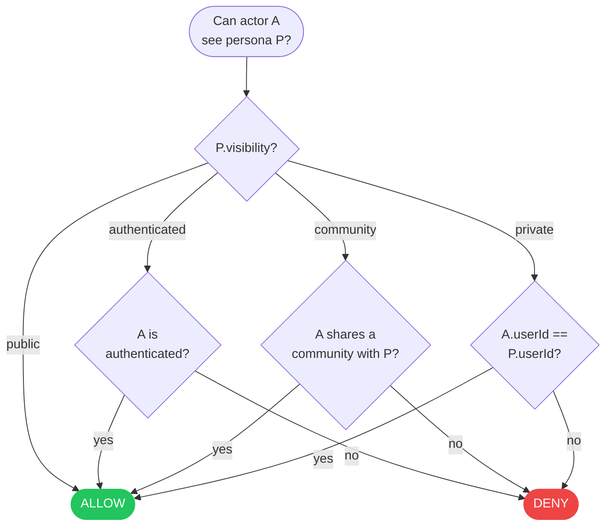

**Important:** `community` visibility does not mean "visible in one specific community." It means "visible to anyone who shares a community with this persona." If Maria's gym persona is `community` visibility and she joins both Iron Oak and a yoga studio community, members of _either_ community can see her persona. If she wants community-specific isolation, she creates separate personas for each community.

### Visibility in Search Results

Search queries include a visibility filter based on the actor:

```
anonymous query       → WHERE visibility = 'public'
authenticated query   → WHERE visibility IN ('public', 'authenticated')
community-scoped query → WHERE visibility IN ('public', 'authenticated', 'community')
                         AND persona is member of the specified community
```

The embedding index doesn't encode visibility — it's a post-filter on the result set. This means all personas get embeddings computed (for future visibility changes), but only permitted ones are returned.

---

## Trait-Level Disclosure {#trait-level-disclosure}

### How Traits Are Authorized

Personus doesn't have per-trait visibility flags. Instead, trait authorization is **structural**: a trait is visible on a persona if and only if the persona owner copied it from their user traits to that persona.

```
User Traits (private, owner-only)
  ├── skills: [React, Python, Powerlifting, Cooking]
  ├── experience: [Google, Meta]
  ├── interests: [Techno DJing, Rock climbing]
  └── values: [Open source, Sustainability]

Professional Persona (public)
  ├── skills: [React, Python]          ← selected
  ├── experience: [Google, Meta]       ← selected
  └── values: [Open source]            ← selected
  (interests, Powerlifting, Cooking, Sustainability: NOT included)

Gym Persona (community)
  ├── skills: [Powerlifting]           ← selected
  └── interests: [Rock climbing]       ← selected
  (React, Python, experience, values: NOT included)
```

**The user's traits are never directly accessible** to any actor other than the owner. They don't have a visibility setting — they're structurally private. The persona is the disclosure boundary.

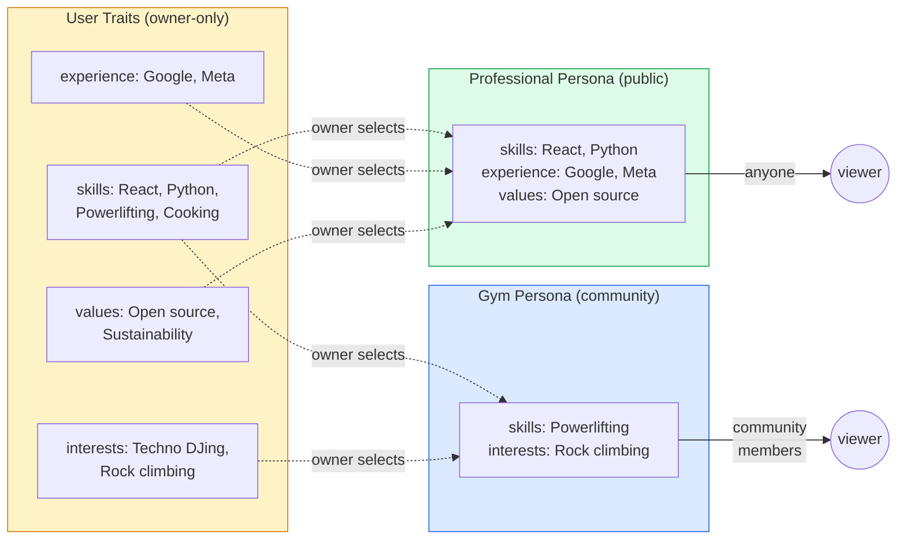

### Why Per-Trait Visibility Isn't Needed

Per-trait visibility (e.g., "show React to community A but hide it from community B within the same persona") would add significant complexity for minimal benefit. The persona model already solves this: if you want different traits visible to different audiences, create different personas. That's the whole point of multi-persona identity.

### User Traits Authorization Rules

| Action                 | Who Can                        | Mechanism                                    |
| ---------------------- | ------------------------------ | -------------------------------------------- |
| View user traits       | Owner only                     | `userId` match on `user_traits`              |
| Edit user traits       | Owner only                     | Server action with auth check                |
| Copy traits to persona | Owner only                     | Persona creation/edit flow                   |
| View persona traits    | Anyone who can see the persona | Persona visibility rules                     |
| Search by trait values | Anyone within visibility scope | JSONB + vector search with visibility filter |

---

## Cross-Persona Linking {#cross-persona-linking}

### Concept

Cross-persona linking is an explicit, voluntary, directional disclosure where a persona owner says: "In this community context, I want people to know about my other persona."

This is a **controlled exception** to the unlinkability principle. The owner creates the link; the system enforces the boundary.

### Data Model

Cross-persona links live in the `memberTraits` JSONB on `community_members`. No new tables.

```
community_members.memberTraits:
{
  ...existing context fields...,
  "linkedPersonas": [
    {
      "personaUri": "personus:persona:maria-pro",
      "label": "Product Designer",
      "note": "Happy to chat about UX or startup ideas"
    }
  ]
}
```

**Fields:**

- `personaUri` — the target persona being linked to (must be owned by the same user)
- `label` — short display label chosen by the owner (doesn't have to match the target persona's headline)
- `note` — optional context ("Ask me about...", "Available for freelance work", etc.)

### Authorization Rules

**Creating a link:**

```
ALLOW if:
  1. The linking user owns BOTH personas (source membership persona + target persona)
  2. The target persona exists and is not "private" visibility
DENY otherwise
```

The system must verify same-user ownership without revealing it to the API caller — this is a server-side check only.

**Viewing a link:**

```
Given: Actor A viewing a linked persona reference on membership M in community G

1. A must be able to see the membership (A is a member of G) → standard community authorization
2. The linked persona's own visibility is then evaluated:
   - If target persona visibility is "public": show full link (clickable to persona page)
   - If target persona visibility is "authenticated": show full link if A is authenticated, show label-only if anonymous
   - If target persona visibility is "community": show full link only if A is a member of a community the target persona belongs to
   - If target persona visibility is "private": suppress the link entirely (as if it doesn't exist)
```

**Key behavior:** The link is suppressed silently when the viewer can't access the target. No "you don't have permission" error — the link simply doesn't render. This prevents information leakage about the existence of other personas.

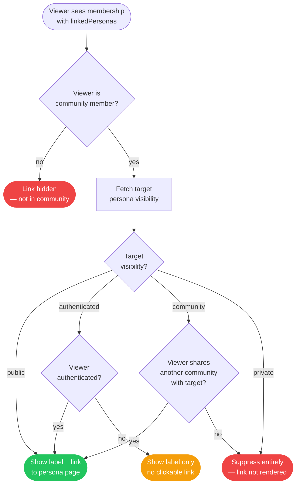

**Removing a link:**

The owner can remove any link at any time by editing their community membership data. Removal is immediate — no cached copies elsewhere.

### What Links Do NOT Enable

- Links do not make the target persona searchable within the source community
- Links do not transfer endorsements across personas
- Links do not create affiliation relationships
- Links do not grant the community admin any access to the target persona
- Links do not appear in MCP search results (they're a UI feature, not a search feature)

### Edge Cases

**What if the target persona is deleted?**
The link becomes a dead reference. The UI should handle this gracefully — show the label but indicate the persona is no longer available, or suppress the link entirely.

**What if the target persona changes visibility to private?**
The link is silently suppressed for all viewers (per the evaluation rules above). The `linkedPersonas` entry remains in contextData but is not rendered. If visibility changes back, the link reappears.

**Can an org persona link to a person persona?**
Yes. An organization might join a chamber of commerce community and link to the owner's personal persona: "Also: Carlos M. — Owner & Lead Plumber." Same rules apply — both must be owned by the same user.

**Can you link to a persona in the same community?**
Yes, though it's unusual. This would surface "I'm also in this community as [other persona]" — useful if someone has both a personal and professional persona in the same community.

---

## Community Authorization {#community-authorization}

### Community Visibility

Communities themselves have a visibility setting:

| Level           | Who Can See the Community | Who Can See Members                                    |
| --------------- | --------------------- | ------------------------------------------------------ |
| `public`        | Anyone                | Anyone (subject to member persona visibility)          |
| `authenticated` | Logged-in users       | Logged-in users (subject to member persona visibility) |
| `private`       | Members only          | Members only                                           |

### Community Membership Roles

| Role     | Can View Directory | Can Search Members | Can View Analytics | Can Manage Schema | Can Approve Members | Can Manage Community |
| -------- | ------------------ | ------------------ | ------------------ | ----------------- | ------------------- | -------------------- |
| `member` | Yes                | Yes                | No                 | No                | No                  | No                   |
| `admin`  | Yes                | Yes                | Yes                | Yes               | Yes                 | Yes (except delete)  |
| `owner`  | Yes                | Yes                | Yes                | Yes               | Yes                 | Yes (full)           |

### Join Policy Authorization

| Policy           | Who Can Join                          | Flow                                      |
| ---------------- | ------------------------------------- | ----------------------------------------- |
| `open`           | Any authenticated user with a persona | Instant join                              |
| `admin-approved` | Any authenticated user can apply      | Application → admin review → approve/deny |
| `invite-only`    | Only users with an invite link/token  | Invite → accept → join                    |

### Community Context Data Authorization

Context data (the fields members fill out for a specific community) follows these rules:

| Action                                  | Who Can                                                  |
| --------------------------------------- | -------------------------------------------------------- |
| View a member's context data            | Any community member (if membership is `visible: true`)  |
| Edit own context data                   | The member (owner of the persona in the membership)      |
| View context data when `visible: false` | Owner + community admins only                            |
| Define context schema fields            | Community admins/owner                                   |
| View aggregated analytics               | Community admins/owner                                   |

**Hidden memberships:** A member can set `visible: false` on their membership. This means:

- They don't appear in the community directory
- Other members can't see their context data
- They can still search and view other members
- Community admins can still see them (for moderation)

---

## Guild Authorization {#guild-authorization}

Guild authorization extends community authorization with tier-based permissions.

### Tier Permissions Matrix

Each guild defines its own tiers with custom permissions. Here's a typical configuration:

| Permission           | Entry Tier | Full Member | Senior | Steward-eligible |
| -------------------- | ---------- | ----------- | ------ | ---------------- |
| `visibleInDirectory` | Yes        | Yes         | Yes    | Yes              |
| `eligibleForRouting` | No         | Yes         | Yes    | Yes              |
| `canVetApplicants`   | No         | No          | Yes    | Yes              |
| `canManageOfferings` | No         | No          | No     | Yes              |
| `canModifyTaxonomy`  | No         | No          | No     | Yes              |
| `canSteward`         | No         | No          | No     | Yes              |

### Guild-Specific Actions

| Action                      | Required Permission                        | Fallback                                    |
| --------------------------- | ------------------------------------------ | ------------------------------------------- |
| View guild public page      | None (public)                              | —                                           |
| View guild member directory | Community membership                       | —                                           |
| Submit a guild request      | Depends on `allowAnonymousRequests` config | Authenticated user if anonymous not allowed |
| Be routed a request         | `eligibleForRouting` on tier               | —                                           |
| Review applications         | `canVetApplicants` on tier                 | Community admin role                        |
| Manage offerings            | `canManageOfferings` on tier               | Community admin role                        |
| Edit skill taxonomy         | `canModifyTaxonomy` on tier                | Community admin role                        |
| Approve request routing     | `canSteward` on tier                       | Community admin role                        |
| View guild analytics        | Community admin role                       | —                                           |

### Tier Evaluation

Tier permissions are resolved at request time:

```
1. Get membership → community_members row
2. Get tierId from memberTraits
3. Look up tier → guild_membership_tiers row
4. Check tier.permissions[requiredPermission]
5. Fallback: check membership.role (admin/owner always have full access)
```

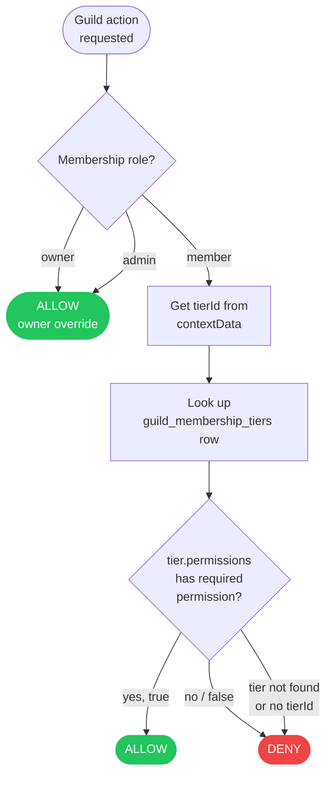

Community admins/owners always have all guild permissions regardless of tier. This prevents a situation where a guild steward locks out the community owner.

---

## Contact Authorization {#contact-authorization}

### Contact Preferences Model

Contact preferences are the GDPR-inspired consent model from the naming plan. They live on each persona as `contactPreferences` (JSONB) and control _how_ someone can interact, separate from _whether_ they can see the persona.

```json
{
  "discovery": {
    "allowAiDiscovery": true,
    "allowPublicDirectory": true,
    "allowCommunityDirectory": true
  },
  "contact": {
    "mode": "mediated",
    "allowFrom": "authenticated",
    "requireReason": true,
    "autoDeclineCategories": ["sales", "recruitment"]
  },
  "dataSharing": {
    "shareWithAgents": "summary",
    "shareEmail": false,
    "sharePhone": false,
    "shareLocation": "city"
  },
  "communication": {
    "allowDigestEmails": true,
    "allowCommunityNotifications": true,
    "allowMarketingEmails": false
  }
}
```

### Contact Authorization Flow

```
1. Can the actor DISCOVER this persona?
   → Check visibility (§Persona Visibility)
   → Check discovery preferences (allowAiDiscovery, allowPublicDirectory, etc.)

2. Can the actor CONTACT this persona?
   → Check contact.mode:
     - "open": anyone who can see the persona can contact
     - "mediated": contact request created → AI triage → owner decides
     - "closed": no contact requests accepted
   → Check contact.allowFrom:
     - "anyone": anonymous + authenticated
     - "authenticated": must be logged in
     - "network": must be in endorsement graph (direct or 2-hop)
     - "community": must share a community
   → Check contact.autoDeclineCategories:
     - AI triage classifies request reason → auto-decline if category matches

3. What data is shared during contact?
   → Check dataSharing preferences
   → AI agent gets "summary" or "full" persona data (never raw user traits)
   → Email/phone/location shared only if explicitly permitted
```

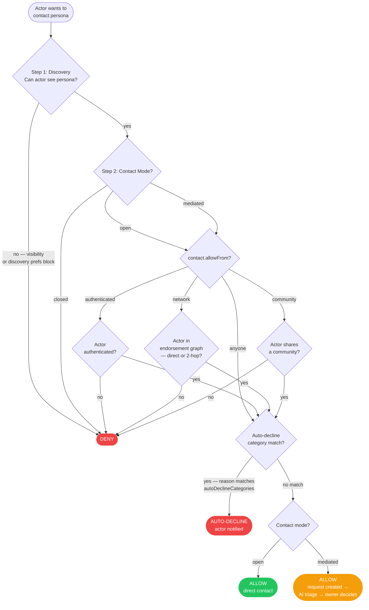

### Contact via Guild Routing

Guild request routing adds a path that partially bypasses individual contact preferences:

```
1. Outsider submits guild request (not to a specific member)
2. Guild routing agent matches members
3. Matched members receive a guild-routed request (distinct from direct contact)
4. Member's contact preferences still apply for RESPONSE:
   - If member's contact.mode is "closed": they're excluded from routing candidates
   - If member's contact.mode is "mediated": guild request appears in their triage queue
   - If member's contact.mode is "open": they're notified directly
```

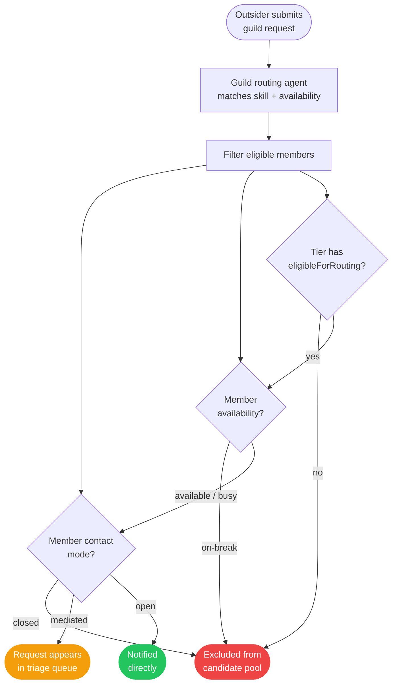

Guild membership implies consent to receive guild-routed requests (at tiers where `eligibleForRouting` is true). Members who don't want routing can set their tier to not eligible, or set `availability: "on-break"` in their guild context data.

---

## Endorsement Authorization {#endorsement-authorization}

### Who Can Endorse Whom

| Endorser       | Target         | Allowed? | Notes                              |
| -------------- | -------------- | -------- | ---------------------------------- |
| Person persona | Person persona | Yes      | Most common case                   |
| Person persona | Org persona    | Yes      | "I trust this business"            |
| Org persona    | Person persona | Yes      | "This person is guild-certified"   |
| Org persona    | Org persona    | Yes      | Business-to-business trust         |
| Any persona    | Shadow persona | Yes      | Creating a shadow = endorsing them |
| Anonymous      | Anyone         | No       | Must have a persona to endorse     |

### Endorsement Visibility

Endorsements have their own `visibility` field:

| Level     | Who Can See                                              |
| --------- | -------------------------------------------------------- |
| `public`  | Anyone who can see both the endorser and target personas |
| `community` | Members of the community where the endorsement was created |
| `private` | Endorser + target only (for pending/draft endorsements)  |

**Compound visibility:** An endorsement is only visible if the viewer can see _both_ the endorser persona and the target persona. If either persona's visibility blocks the viewer, the endorsement is hidden.

```
Can actor A see endorsement E?
  → A can see E.fromPersona (per persona visibility rules)
  AND A can see E.toPersona (per persona visibility rules)
  AND E.visibility permits A (per endorsement visibility level)
  AND E.active == true
```

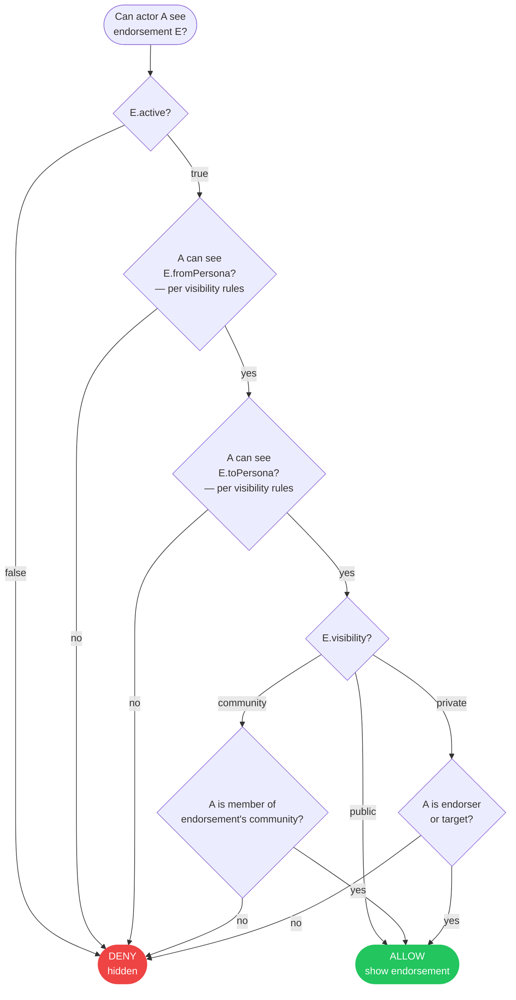

### Endorsement Modification

| Action                         | Who Can                                                             |
| ------------------------------ | ------------------------------------------------------------------- |
| Create endorsement             | Any persona (for targets they can see)                              |
| Edit own endorsement           | The endorser                                                        |
| Retract endorsement            | The endorser (sets `active: false`)                                 |
| Delete endorsement             | The endorser or target (either party)                               |
| View endorsements on a persona | Anyone who can see the persona (filtered by endorsement visibility) |

---

## AI Agent & MCP Authorization {#agent-authorization}

### Access Tiers

AI agents (Claude, ChatGPT, custom agents) access Personus via MCP tools or GraphQL. Access is tiered:

| Tier              | Authentication         | Can Search                | Can View                      | Can Contact                     | Can View Guilds        | Rate Limit |
| ----------------- | ---------------------- | ------------------------- | ----------------------------- | ------------------------------- | ---------------------- | ---------- |
| **Anonymous**     | None (public endpoint) | Public personas only      | Public data only              | No                              | Public guild pages     | Low        |
| **Authenticated** | API key (user-linked)  | Public + authenticated    | Public + authenticated data   | Yes (mediated)                  | Public + member guilds | Medium     |
| **Enterprise**    | OAuth + contract       | Full (per-contract scope) | Full (per data sharing prefs) | Yes (mediated, priority triage) | Full                   | High       |

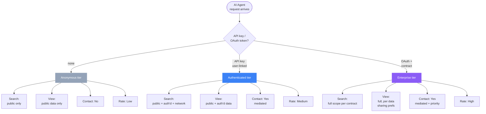

### What Agents Receive

Agents never receive raw data. MCP tool responses are filtered and formatted:

```
personus_search response:
  → Only personas whose visibility + discovery preferences permit this agent tier
  → Trait data filtered by dataSharing preference:
    - "summary": AI-generated 2-sentence summary of relevant traits
    - "full": complete trait data from the persona (not the user traits)
    - "none": persona appears in results but no trait details
  → Endorsement data filtered by endorsement visibility rules
  → Contact channels only if dataSharing permits
```

### Agent Actions Authorization

| MCP Tool                        | Anonymous        | Authenticated             | Enterprise     |
| ------------------------------- | ---------------- | ------------------------- | -------------- |
| `personus_search`               | Public only      | Public + auth'd + network | Full scope     |
| `personus_get_persona`          | Public only      | Public + auth'd           | Full scope     |
| `personus_request_introduction` | No               | Yes                       | Yes (priority) |
| `personus_list_communities`     | Public communities | Public + member communities | All communities |
| `personus_list_guilds`          | Public guilds    | Public + member guilds    | All guilds     |
| `personus_submit_guild_request` | Per guild config | Yes                       | Yes            |
| `personus_get_affiliations`     | Public only      | Public + auth'd           | Full scope     |

---

## Data Ownership & Delegation {#data-ownership}

### Ownership Rules

Every piece of data in Personus has a clear owner:

| Data                 | Owner                                        | Can Delegate?                                               |
| -------------------- | -------------------------------------------- | ----------------------------------------------------------- |
| User account         | The user                                     | No                                                          |
| User traits          | The user                                     | No                                                          |
| Persona              | The user who created it                      | No (but org personas can have affiliated managers — future) |
| Community            | The user who created it (owner role)         | Yes — admin role grants most permissions                    |
| Community membership | The member (their persona)                   | No                                                          |
| Endorsement          | The endorser                                 | No (but target can delete)                                  |
| Shadow persona       | The creator (until claimed)                  | Transfers to claimer on claim                               |
| Guild skill taxonomy | Guild org persona owner + stewards           | Yes — steward tier                                          |
| Guild offering       | Guild org persona owner + stewards           | Yes — offering management tier                              |
| Guild request        | The requester (lifecycle managed by guild)   | Routing managed by steward/system                           |
| Cross-persona link   | The member who created it                    | No                                                          |
| Contact request      | The requester (but target controls response) | No                                                          |

### Shadow Persona Ownership Transfer

Shadow personas have a unique ownership lifecycle:

```
1. Created by endorser → endorser is owner
   - Endorser can edit traits, retract the shadow
   - Shadow is discoverable but contactable only through endorser

2. Claim initiated by real person → pending transfer
   - Claimer proves identity (claim token or admin verification)
   - Shadow traits are offered to claimer as starting point

3. Claim completed → claimer is owner
   - Shadow converts to regular persona under claimer's account
   - Original endorsement transfers to new persona
   - Endorser retains their endorsement but loses edit rights
   - Claimer can modify all traits
```

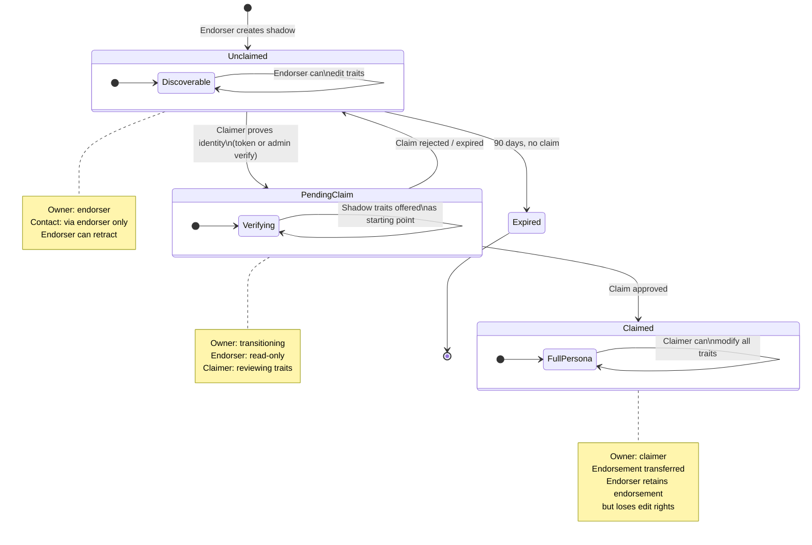

### Organization Persona Delegation (Future)

Currently, an org persona is owned by a single user. Future work may allow:

- Multiple users to manage an org persona (delegated admin)
- Affiliated members to manage their own affiliation details
- Guild stewards to manage guild-level data without owning the org persona

This is not yet designed. When it is, it should extend the ownership model with explicit delegation records, not implicit role-based access.

---

## Authorization Decision Reference {#decision-reference}

### Quick Reference Matrix

This matrix covers the most common authorization decisions. Read as: "Can [actor] do [action] on [target]?"

#### Viewing Personas

| Actor → Target ↓      | Anonymous | Auth'd User | Community Member | Community Admin | Owner |
| --------------------- | --------- | ----------- | ---------------- | --------------- | ----- |
| Public persona        | Yes       | Yes         | Yes          | Yes         | Yes   |
| Authenticated persona | No        | Yes         | Yes          | Yes         | Yes   |
| Community persona     | No        | No          | Yes              | Yes             | Yes   |
| Private persona       | No        | No          | No           | No          | Yes   |

#### Viewing Persona Traits

Same as viewing the persona — traits are part of the persona document. No per-trait authorization.

#### Viewing Endorsements

| Actor → Target ↓                               | Anonymous | Auth'd User | Community Member | Community Admin |
| ---------------------------------------------- | --------- | ----------- | ---------------- | --------------- |
| Public endorsement (both personas visible)     | Yes       | Yes         | Yes              | Yes             |
| Community endorsement (in actor's community)   | No        | No          | Yes              | Yes             |
| Private endorsement                        | No        | No          | No           | No          |

#### Viewing Community Members

| Actor → Target ↓                   | Anonymous | Auth'd User | Community Member | Community Admin |
| ---------------------------------- | --------- | ----------- | ---------------- | --------------- |
| Public community, visible member   | Yes       | Yes         | Yes              | Yes             |
| Auth'd community, visible member   | No        | Yes         | Yes              | Yes             |
| Private community, visible member  | No        | No          | Yes              | Yes             |
| Any community, hidden member       | No        | No          | No               | Yes             |

#### Viewing Cross-Persona Links

| Actor → Link Target Visibility ↓          | Anonymous    | Auth'd Community Member | Community Admin |
| ----------------------------------------- | ------------ | ----------------------- | --------------- |
| Target is public                          | Label + link | Label + link            | Label + link    |
| Target is authenticated                   | Label only   | Label + link            | Label + link    |
| Target is community (shared community)    | Suppressed   | Label + link            | Label + link    |
| Target is community (no shared community) | Suppressed   | Suppressed              | Suppressed      |
| Target is private                 | Suppressed   | Suppressed          | Suppressed   |

#### Contact Actions

| Actor → Action ↓                                    | Anonymous  | Auth'd User | Network Member | Community Member |
| --------------------------------------------------- | ---------- | ----------- | -------------- | ---------------- |
| Contact "open" persona                              | No         | Yes         | Yes            | Yes              |
| Contact "mediated" persona (allowFrom: anyone)      | No         | Yes         | Yes            | Yes              |
| Contact "mediated" persona (allowFrom: network)     | No         | No          | Yes            | Yes              |
| Contact "mediated" persona (allowFrom: community)   | No         | No          | No             | Yes              |
| Contact "closed" persona                        | No         | No          | No             | No           |
| Submit guild request                            | Per config | Yes         | Yes            | Yes          |

#### Management Actions

| Actor → Action ↓            | Member | Admin | Owner | Steward (Guild) |
| --------------------------- | ------ | ----- | ----- | --------------- |
| Edit own membership context | Yes    | Yes   | Yes   | Yes             |
| Edit community schema       | No     | Yes   | Yes   | Yes             |
| Approve/deny join requests  | No     | Yes   | Yes   | Yes             |
| View community analytics    | No     | Yes   | Yes   | Yes             |
| Delete community            | No     | No    | Yes   | No              |
| Manage guild taxonomy       | No     | Yes   | Yes   | Yes             |
| Manage guild offerings      | No     | Yes   | Yes   | Yes             |
| Route guild requests        | No     | Yes   | Yes   | Yes             |
| Vet guild applicants        | No     | Yes   | Yes   | Per tier        |

---

## Implementation Guidance {#implementation-guidance}

### Technology Decisions

**Authentication: Clerk** (already in stack)
Clerk provides user identity, session management, and JWT tokens. It answers "who is this person?" but not "what can they do?" — that's the authorization layer's job.

**Authorization: CASL (`@casl/ability`)**
CASL is the authorization library for Personus. It was chosen for:

- **Fully embedded** — no sidecar, no external service. Runs in Next.js server actions and API routes directly.
- **ABAC via MongoDB-like conditions** — maps naturally to our JSONB persona attributes and contact preferences.
- **Isomorphic** — same ability definitions work server-side (enforcement) and client-side (conditional UI rendering).
- **TypeScript-native** — type-safe ability builder, subject type inference.
- **950K+ weekly downloads, MIT license** — no usage pricing, no MAU limits, well-established ecosystem.

Packages: `@casl/ability` (core), `@casl/react` (React integration for conditional rendering).

### Where Authorization Lives

```
lib/auth/
  ├── provider.ts          → Auth provider interface (existing)
  ├── clerk.ts             → Clerk implementation (existing)
  ├── abilities.ts         → CASL ability definitions (new)
  ├── permissions.ts       → Multi-step authorization orchestration (new)
  └── types.ts             → Actor, Action, Context, Subject types (new)
```

**Two layers of authorization logic:**

1. **`abilities.ts`** — CASL ability definitions. Handles the ~80% of checks that are direct attribute-based conditions (persona visibility, own-resource access, role-based management actions, guild tier permissions, MCP tier scoping).

2. **`permissions.ts`** — Orchestration functions for multi-step decisions that CASL conditions alone can't express. These call CASL internally but compose multiple checks (cross-persona link visibility, endorsement compound visibility, full contact authorization flow).

### Clerk → CASL Integration

The integration point is a function that reads Clerk's authenticated session and builds a CASL ability instance. This runs on every server action / API route.

```typescript
// lib/auth/abilities.ts
import { AbilityBuilder, createMongoAbility, MongoAbility } from '@casl/ability';
import { auth } from '@/lib/auth';

// Subject types matching our data model
type Subjects =
  | 'Persona'
  | 'UserTraits'
  | 'Community'
  | 'Membership'
  | 'Endorsement'
  | 'ShadowPersona'
  | 'ContactRequest'
  | 'GuildRequest'
  | 'GuildOffering'
  | 'GuildTaxonomy'
  | 'ActivityEvent'
  | 'all';

type Actions =
  | 'create'
  | 'read'
  | 'update'
  | 'delete'
  | 'manage'
  | 'contact'
  | 'endorse'
  | 'route'
  | 'search';

export type AppAbility = MongoAbility<[Actions, Subjects]>;

// Context resolved before ability building
interface AbilityContext {
  communityMemberships?: Array<{
    communityId: string;
    personaUri: string;
    role: 'member' | 'admin' | 'owner';
    guildTierId?: string;
    guildPermissions?: Record<string, boolean>;
  }>;
  mcpAccessTier?: 'anonymous' | 'authenticated' | 'enterprise';
}

export function defineAbilitiesFor(userId: string | null, context?: AbilityContext): AppAbility {
  const { can, cannot, build } = new AbilityBuilder<AppAbility>(createMongoAbility);

  // ── Layer 2: Persona Visibility ──────────────────────────

  // Everyone (including anonymous) can read public personas
  can('read', 'Persona', { visibility: 'public' });
  can('search', 'Persona', { visibility: 'public' });

  if (userId) {
    // Authenticated users can also see authenticated-visibility personas
    can('read', 'Persona', { visibility: 'authenticated' });
    can('search', 'Persona', { visibility: 'authenticated' });

    // Owner can manage all their own resources
    can('manage', 'Persona', { userId });
    can('manage', 'UserTraits', { userId });

    // Authenticated users can create resources
    can('create', 'Persona');
    can('create', 'Endorsement');
    can('create', 'ContactRequest');
    can('create', 'ShadowPersona');

    // Owner can always read their private personas
    can('read', 'Persona', { visibility: 'private', userId });
  }

  // ── Layer 3 + 5: Community / Guild Context ──────────────

  if (context?.communityMemberships) {
    const memberCommunityIds = context.communityMemberships.map((m) => m.communityId);

    // Community members can read community-visibility personas in their communities
    can('read', 'Persona', {
      visibility: 'community',
      communityIds: { $in: memberCommunityIds },
    });
    can('search', 'Persona', {
      visibility: 'community',
      communityIds: { $in: memberCommunityIds },
    });

    // Per-community role permissions
    for (const membership of context.communityMemberships) {
      // All members can read community directory and edit own membership
      can('read', 'Membership', { communityId: membership.communityId });
      can('update', 'Membership', {
        communityId: membership.communityId,
        personaUri: membership.personaUri,
      });

      // Admin / owner permissions
      if (membership.role === 'admin' || membership.role === 'owner') {
        can('manage', 'Community', { id: membership.communityId });
        can('manage', 'Membership', { communityId: membership.communityId });
        can('read', 'ActivityEvent', { communityId: membership.communityId });

        // Admins get all guild permissions regardless of tier
        can('manage', 'GuildTaxonomy', { guildCommunityId: membership.communityId });
        can('manage', 'GuildOffering', { guildCommunityId: membership.communityId });
        can('route', 'GuildRequest', { guildCommunityId: membership.communityId });
      }

      // Owner-only: delete community
      if (membership.role !== 'owner') {
        cannot('delete', 'Community', { id: membership.communityId });
      }

      // Guild tier permissions (for non-admin members)
      if (membership.guildPermissions && membership.role === 'member') {
        const gp = membership.guildPermissions;
        if (gp.canVetApplicants) {
          can('update', 'Membership', {
            communityId: membership.communityId,
            status: 'pending', // approve/deny applications
          });
        }
        if (gp.canManageOfferings) {
          can('manage', 'GuildOffering', { guildCommunityId: membership.communityId });
        }
        if (gp.canModifyTaxonomy) {
          can('manage', 'GuildTaxonomy', { guildCommunityId: membership.communityId });
        }
        if (gp.canSteward) {
          can('route', 'GuildRequest', { guildCommunityId: membership.communityId });
        }
      }
    }
  }

  // ── MCP Agent Tiers ──────────────────────────────────────

  if (context?.mcpAccessTier === 'enterprise') {
    can('search', 'Persona'); // full scope, filtered by dataSharing prefs at query time
    can('read', 'Persona');
    can('create', 'ContactRequest'); // priority triage
  }
  // anonymous and authenticated MCP tiers use the same rules
  // as anonymous/authenticated users above

  return build();
}
```

### Server Action Pattern

Every server action resolves Clerk auth, builds CASL abilities, and checks before acting:

```typescript
// app/actions/personas.ts
'use server';

import { auth } from '@/lib/auth';
import { defineAbilitiesFor } from '@/lib/auth/abilities';
import { ForbiddenError } from '@casl/ability';
import { db } from '@/lib/db';

export async function updatePersona(personaId: string, data: Partial<Persona>) {
  // 1. Clerk resolves identity
  const { userId } = await auth();
  if (!userId) throw new Error('Not authenticated');

  // 2. Fetch the target resource
  const persona = await db.query.personas.findFirst({
    where: eq(personas.id, personaId),
  });
  if (!persona) throw new Error('Not found');

  // 3. Build abilities and check
  const ability = defineAbilitiesFor(userId);
  ForbiddenError.from(ability).throwUnlessCan('update', {
    ...persona,
    kind: 'Persona', // subject type marker
  });

  // 4. Proceed with the update
  return db.update(personas).set(data).where(eq(personas.id, personaId));
}
```

### Client-Side Conditional Rendering

CASL's React integration enables the UI to match server-side permissions without duplicating logic:

```typescript
// components/persona-actions.tsx
'use client';

import { Can } from '@casl/react';
import { useAbility } from '@/hooks/use-ability';

export function PersonaActions({ persona }: { persona: Persona }) {
  const ability = useAbility(); // built from Clerk session on client

  return (
    <>
      <Can I="update" this={persona} ability={ability}>
        <EditPersonaButton persona={persona} />
      </Can>
      <Can I="delete" this={persona} ability={ability}>
        <DeletePersonaButton persona={persona} />
      </Can>
      <Can I="contact" this={persona} ability={ability}>
        <ContactButton persona={persona} />
      </Can>
    </>
  );
}
```

### Multi-Step Orchestration Functions

For decisions that require composing multiple CASL checks or evaluating JSONB preferences, `permissions.ts` provides orchestration functions. These are pure functions — no database calls — that take pre-fetched data and return decisions.

```typescript
// lib/auth/permissions.ts
import { AppAbility } from './abilities';

/**
 * Core persona visibility check.
 * Delegates to CASL for the attribute condition.
 */
export function canActorViewPersona(ability: AppAbility, persona: Persona): boolean {
  return ability.can('read', { ...persona, kind: 'Persona' });
}

/**
 * Cross-persona link visibility.
 * CASL can't express this alone — it requires checking the TARGET persona's
 * visibility against the viewer, which is a second resource lookup.
 */
export function resolveLinkedPersonaVisibility(
  ability: AppAbility,
  link: LinkedPersona,
  targetPersona: Persona | null,
): 'full' | 'label-only' | 'suppressed' {
  // Target persona deleted or not found
  if (!targetPersona) return 'suppressed';

  // Target is private — always suppress
  if (targetPersona.visibility === 'private') return 'suppressed';

  // Can the viewer see the target persona?
  if (ability.can('read', { ...targetPersona, kind: 'Persona' })) {
    return 'full';
  }

  // Authenticated viewer seeing an authenticated persona gets label-only
  // (they can see it exists but CASL denied read due to community scope)
  if (targetPersona.visibility === 'authenticated') {
    return 'label-only';
  }

  return 'suppressed';
}

/**
 * Endorsement compound visibility.
 * Both the endorser and target persona must be visible to the viewer,
 * AND the endorsement's own visibility must permit the viewer.
 */
export function canActorViewEndorsement(
  ability: AppAbility,
  endorsement: Endorsement,
  fromPersona: Persona,
  toPersona: Persona,
): boolean {
  if (!endorsement.active) return false;
  if (!ability.can('read', { ...fromPersona, kind: 'Persona' })) return false;
  if (!ability.can('read', { ...toPersona, kind: 'Persona' })) return false;
  return ability.can('read', { ...endorsement, kind: 'Endorsement' });
}

/**
 * Full contact authorization flow.
 * Three-step evaluation: discovery → contact mode/allowFrom → auto-decline.
 */
export function canActorContactPersona(
  ability: AppAbility,
  actor: Actor,
  targetPersona: Persona,
  sharesCommunity: boolean,
  isInNetwork: boolean,
): { allowed: boolean; mode: 'direct' | 'mediated' | null; reason?: string } {
  // Step 1: Can actor see the persona at all?
  if (!ability.can('read', { ...targetPersona, kind: 'Persona' })) {
    return { allowed: false, mode: null, reason: 'persona_not_visible' };
  }

  const prefs = targetPersona.contactPreferences as ContactPreferences;
  const contactMode = prefs?.contact?.mode ?? 'mediated';

  // Step 2: Contact mode check
  if (contactMode === 'closed') {
    return { allowed: false, mode: null, reason: 'contact_closed' };
  }

  // Step 2b: allowFrom check
  const allowFrom = prefs?.contact?.allowFrom ?? 'authenticated';
  if (allowFrom === 'network' && !isInNetwork && !sharesCommunity) {
    return { allowed: false, mode: null, reason: 'not_in_network' };
  }
  if (allowFrom === 'community' && !sharesCommunity) {
    return { allowed: false, mode: null, reason: 'not_in_community' };
  }

  // Step 3: result based on mode
  return {
    allowed: true,
    mode: contactMode === 'open' ? 'direct' : 'mediated',
  };
}
```

### What CASL Handles vs. Custom Logic

| Authorization Decision                           | Implementation                 | Why                                     |
| ------------------------------------------------ | ------------------------------ | --------------------------------------- |
| Persona visibility (public/auth'd/community/private) | CASL conditions            | Direct attribute match                  |
| Own-resource access (edit own persona/traits)    | CASL conditions                | `{ userId: actor.id }`                  |
| Community role checks (admin can manage schema)  | CASL role → ability mapping    | Standard RBAC pattern                   |
| Guild tier permissions                           | CASL via `guildPermissions`    | Tier resolved, then mapped to abilities |
| MCP agent tier scoping                           | CASL via `mcpAccessTier`       | Tier → ability mapping                  |
| Cross-persona link visibility                    | `permissions.ts` orchestration | Requires second resource lookup         |
| Endorsement compound visibility                  | `permissions.ts` orchestration | Requires checking both personas         |
| Full contact authorization flow                  | `permissions.ts` orchestration | Multi-step with JSONB prefs             |
| Auto-decline category matching                   | `permissions.ts` + AI triage   | Requires reason classification          |

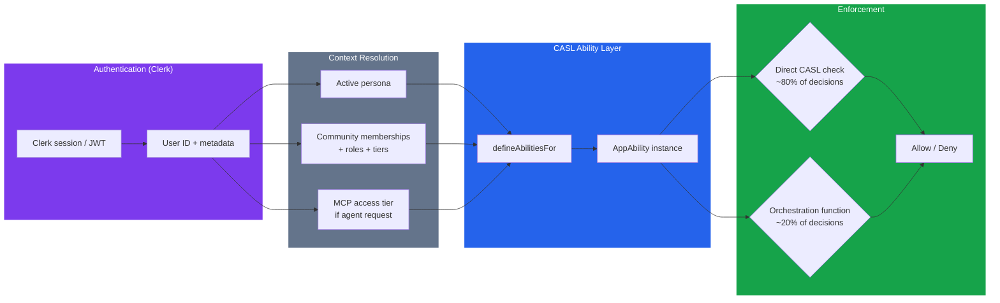

### Database-Level Enforcement

CASL operates at the application level. For defense-in-depth, some rules should also be enforced at the database level:

**RLS candidates (good fit for Postgres RLS):**

- User traits: only the owning user can read/write
- Personas: owner can always read/write; others filtered by visibility
- Memberships: owner can read/write own; community members can read visible ones

**Application-level only (CASL + orchestration, RLS insufficient):**

- Cross-persona link visibility (requires fetching target persona visibility + viewer context)
- Contact authorization (requires evaluating JSONB preferences against actor context)
- Guild tier permissions (requires joining membership → tier → permissions)
- Endorsement compound visibility (requires checking both source and target persona visibility)
- MCP access tier scoping (requires external auth context not available to RLS)

### Audit Trail

Authorization-sensitive actions should be logged to `activity_events`:

| Event Type                | Logged Data                                       |
| ------------------------- | ------------------------------------------------- |
| `persona.viewed`          | Viewer (actor type + ID), target persona, context |
| `contact.requested`       | Requester, target, reason category, triage result |
| `contact.auto_declined`   | Target preferences that triggered decline         |
| `guild.request_routed`    | Request ID, matched members, routing mode         |
| `membership.link_created` | Source persona, target persona, community         |
| `endorsement.created`     | Endorser, target, strength, visibility            |

Audit events are visible to the data owner (on their activity feed) and to system admins (for abuse detection). They are not visible to other users.

---

**End of Authorization & Permissions Document**

**Cross-references:**

- Doc 1 §Foundational Principles — Principle 3 (privacy via unlinkability), Principle 10 (general endorsements with discovery context)
- Doc 2 §Personas — visibility field, contact preferences, trait denormalization
- Doc 2 §Communities & Memberships — community visibility, join policy, roles, context data
- Doc 3 §MCP Tools — access tiers, tool-level authorization
- Doc 8 §Guilds — tier-based permissions, steward role, request routing authorization
